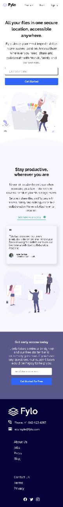

# Fylo Landing Page Challenge Solution

This is a Solution for the **Fylo Landing Page Challenge** from [frontendmentor.io](https://frontendmentor.io)

## 🖼 Previews

### Mobile Preview

### Desktop Preview

## 🛠 Tools and Tech

- [Visual Studio Code](https://code.visualstudio.com)
- HTML
- CSS `flex` and `grid`
- Responsive Design
- Bootstrap Icons - _for social media icons_
- SVG

## 👋 Links

- GitHub repository: https://github.com/Code-Beaker/fylo-landing-page-fmentor-project

- Vercel deployment: https://fylo-landing-page-fmentor-project.vercel.app/

- GitHub Pages deployment: https://code-beaker.github.io/fylo-landing-page-fmentor-project/

## 🔗 Social Links

